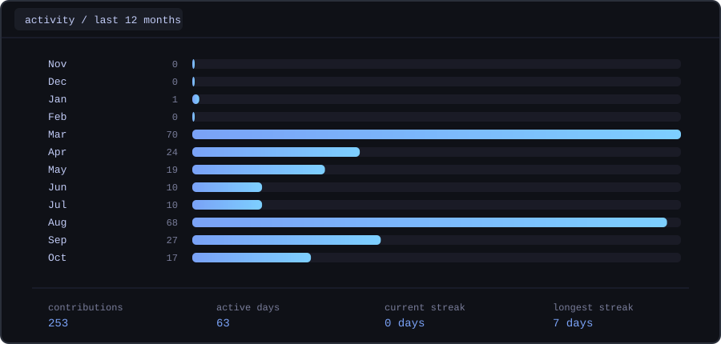

# Mitchell Bialecki

  <strong>B.S. Computer Science Candidate</strong> · <strong>Accelerated M.S. Computer Systems Engineering Candidate</strong> 
  Arizona State University

  

 

## About

I'm an accelerated master's student in **Computer Systems Engineering at Arizona State University**, interested in building reliable systems across the hardware/software boundary.

My primary interests include FPGA development, embedded systems, computer networking, cybersecurity, cyber-physical systems, backend engineering, and semiconductor systems.

I enjoy working on projects where software interacts closely with hardware, infrastructure, or real-world systems.

## Selected Work

### [Stoa](https://github.com/mbialecki3/stoa)

A repository-aware dependency analysis platform for exploring software dependencies, vulnerabilities, and supporting evidence across multiple data sources.

`C#` · `ASP.NET Core` · `React` · `TypeScript` · `PostgreSQL` · `Docker`

---

### [Semiconductor Fab Analytics](https://github.com/mbialecki3/semiconductor-fab-analytics)

A semiconductor manufacturing analytics environment focused on process monitoring, statistical analysis, visualization, and data-driven manufacturing decisions.

`Python` · `PostgreSQL` · `Plotly` · `Streamlit`

---

### [AI Inference Benchmarking Lab](https://github.com/mbialecki3/AI-Inference-Benchmarking-Lab)

A benchmarking environment for evaluating computer-vision inference across different runtimes and compute backends.

`Python` · `PyTorch` · `ONNX Runtime` · `OpenVINO` · `CUDA`

---

### [The Phoenix Protocol](https://github.com/mbialecki3/The-Phoenix-Protocol)

A server-side Fabric mod implementing configurable hardcore world resets, player life management, and persistent server-side state.

`Java` · `Fabric`

 

## Technologies

 

## Areas of Interest

`FPGA Development` · `Embedded Systems` · `Cyber-Physical Systems` · `Computer Networking` · `Cybersecurity` · `Backend Systems` · `Semiconductor Engineering`

 

## Activity

